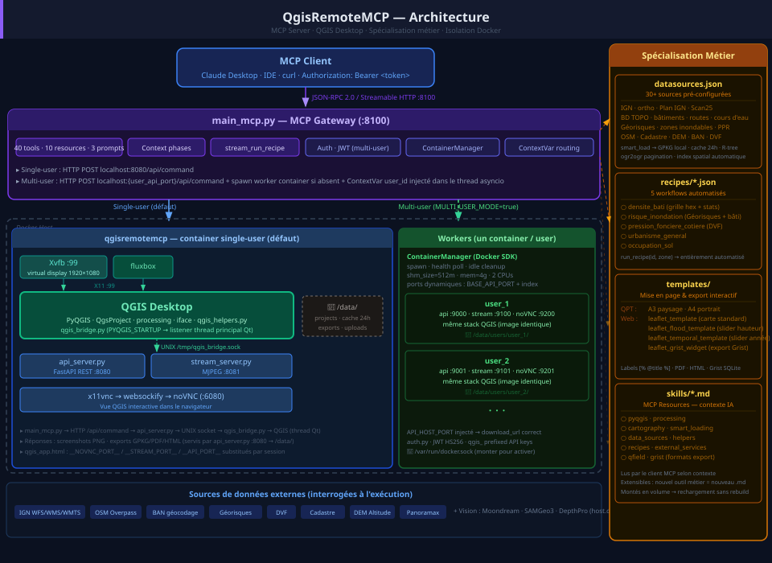

# QgisRemoteMCP — QGIS Desktop as an MCP Server

> Give any AI assistant a complete GIS workstation — data loading, spatial analysis, cartography, and multi-format export — all running in a live QGIS Desktop instance.

**QgisRemoteMCP** is an [MCP](https://modelcontextprotocol.io/) server that exposes a full QGIS Desktop through Docker. The AI loads data, runs analysis, produces maps — while users interact with the same instance in their browser via noVNC.


-brightgreen)


> **Project status**: Production-ready for single-user local deployments. Multi-user mode (per-user isolated containers with GPU passthrough) is functional but in beta. Developed at [Cerema Méditerranée](https://www.cerema.fr/) — published to share the approach and invite contributions.

<p align="center">
  
</p>

---

## What it does

| You say to the AI | What happens |
|---|---|
| *"Analyse le risque inondation à Nîmes"* | Loads flood zones + buildings, computes exposure, exports interactive HTML with water height slider |
| *"Carte de densité du bâti à Montpellier"* | Downloads 10,000 buildings as local GPKG, creates hex grid, graduated symbology, PDF A3 export |
| *"Prépare un relevé terrain pour Sète"* | Loads data, styles layers, exports QField-ready ZIP with editable Observations layer (camera, dropdowns) |
| *"Analyse l'évolution foncière sur la côte"* | DVF transactions 2020-2024, coastal distance bands, temporal web map with animated playback |

Everything runs inside Docker — the AI calls MCP tools, QGIS does the work, the user sees results live in their browser. No local QGIS installation needed.

---

## Quick start

### 1. Run

```bash
git clone https://github.com/nic01asFr/BigQgisMCP.git
cd BigQgisMCP
cp .env.example .env
docker compose up -d --build
```

### 2. Verify

| Service | URL |
|---------|-----|
| MCP Server | http://localhost:8100/mcp |
| noVNC (QGIS in browser) | http://localhost:6080 |
| REST API | http://localhost:8081 |
| MJPEG stream | http://localhost:8082/stream |

```bash
curl http://localhost:8100/health
# → {"status":"ok","bridge":true,"server":"QgisRemoteMCP","multi_user":false}
```

### 3. Connect Claude Desktop

Edit `claude_desktop_config.json`:

```json
{
  "mcpServers": {
    "qgis": {
      "type": "http",
      "url": "http://localhost:8100/mcp"
    }
  }
}
```

### 4. Connect Claude Code

The repo includes a `.mcp.json` — Claude Code picks it up automatically when you open the project directory.

---

## Smart data loading

The core innovation: a structured pipeline that replaces unreliable live WFS connections with fast local GeoPackage files.

| Problem | Live WFS | Smart Loading |
|---------|----------|---------------|
| Pagination | IGN silently truncates at 5000 | ogr2ogr handles all pages automatically |
| Spatial index | None (in-memory) | R-tree in GeoPackage |
| Processing speed | 60-250x slower | Fast local file |
| Network during analysis | HTTP per feature | Zero network |
| CRS confusion | Mixed 4326/3857/2154 | Standardized EPSG:2154 |

```
1. set_study_zone("Montpellier")         → geocode, store bbox, zoom
2. smart_load("osm_xyz")                 → basemap (streaming)
3. smart_load("bdtopo_batiments")        → 10,000 buildings as local GPKG
4. run_processing / execute_python       → analyse (fast, no network)
5. export_pdf / export_web_map           → deliver
```

Downloads are cached in `/data/cache/` with bbox hash — same area = instant reload for 24h.

### Performance (Montpellier, ~10 km bbox)

| Operation | Features | Time |
|-----------|----------|------|
| Download buildings | 10,000 | ~30s |
| Download roads | 5,000 | 6.8s |
| Cache reload (2nd call) | 10,000 | instant |
| Buffer 50m | 10,000 | 1.8s |
| Density grid 500m | 440 cells | 0.3s |

---

## Available data sources

All sources are free (IGN open data since July 2021). No API key needed. 30+ pre-configured in `datasources.json`.

### Vector (WFS → local GPKG)

| ID | Name | Key attributes |
|----|------|----------------|
| `bdtopo_batiments` | Buildings | nature, usage, height, floors, materials |
| `bdtopo_routes` | Roads | nature, importance, width, lanes, speed |
| `bdtopo_hydrographie` | Rivers | name, class, width |
| `bdtopo_communes` | Communes | name, INSEE code, population |
| `admin_express_communes` | Communes (Admin Express) | name, code, population |
| `rpg` | Agricultural parcels | crop type, area |
| + 10 more | BD TOPO vegetation, railways, POI, activity zones... | |

### Basemaps & imagery (streaming)

| ID | Name |
|----|------|
| `osm_xyz` | OpenStreetMap |
| `ign_planign` | Plan IGN v2 |
| `ign_ortho_wmts` | IGN orthophotos |
| `ign_cadastre` | Cadastral parcels |
| `corine_land_cover` | Land cover 2018 |
| `ign_dem` | High-resolution DEM |
| + 10 more | Esri, Stamen, CartoDB, infrared, SCAN 25... |

### APIs

`ban_geocode` (address search), `geo_api_communes` (commune info), `dvf_api` (property transactions), `panoramax` (street imagery), `ign_altimetrie` (elevation).

---

## Recipes

Pre-built workflow templates — from data loading to styled map export in one command.

| ID | Name | Output |
|----|------|--------|
| `densite_bati` | Building density | Hex grid + graduated symbology + PDF |
| `urbanisme_general` | Urban overview | Buildings, roads, vegetation + categorized styles |
| `risque_inondation` | Flood risk | Flood zones + building exposure + interactive web map |
| `occupation_sol` | Land cover | Corine Land Cover + categorized symbology |
| `pression_fonciere_cotiere` | Coastal land pressure | DVF 2020-2024 + coastal bands + temporal web map |

```python
# Automated — all steps in one shot
run_recipe(id="risque_inondation", zone="Nimes")

# Manual — follow steps one by one
get_recipe(id="densite_bati", zone="Montpellier")
```

---

## Export formats

| Format | Tool | Output |
|--------|------|--------|
| **PDF** | `export_pdf` | Print-ready layout (A3 landscape, A4 portrait) with title, legend, scalebar |
| **Web map** | `export_web_map` | Leaflet HTML with embedded GeoJSON, layer toggle, popups |
| **Flood map** | `export_flood_map` | Interactive HTML — water height slider, building exposure stats, animation |
| **Temporal map** | `export_temporal_map` | Interactive HTML — year slider, trend arrows, animated playback |
| **QField** | `export_qfield` | Portable ZIP for mobile (.qgz + GPKGs + editable Observations layer) |
| **Grist** | `export_grist` | Collaborative document with typed columns, map widget, form pages |
| **Layer** | `export_layer` | GPKG, GeoJSON, Shapefile, or CSV |

### Grist export — universal HTML converter

`export_grist` has two modes:
1. **From QGIS project** — exports loaded layers as Grist tables with map widget
2. **From any HTML file** — takes any Leaflet HTML containing GeoJSON (flood maps, temporal maps, qgis2web) and creates a Grist document with data in tables and the original interactive map as a custom widget

Auto-detected column types: `Choice` (colored dropdowns), `Date` (epoch timestamps), `Ref` (cross-table references). Form-like tables get a Grist Form page.

---

## MCP tools (40)

### Smart loading
| Tool | Description |
|------|-------------|
| `set_study_zone` | Define study area (commune, address, bbox). Geocodes, stores bbox, zooms. |
| `get_study_zone` | Get current zone (name, bbox in 4326 + 2154). |
| `smart_load` | Load data by catalog ID. WFS → local GPKG. Rasters stream. |
| `list_datasources` | Browse data catalog (filter by category or search). |
| `add_from_catalog` | Add source by catalog ID. |

### Core
| Tool | Description |
|------|-------------|
| `execute_python` | Run PyQGIS code with `helpers` module, `iface`, `project`, `processing`. |
| `get_screenshot` | Capture QGIS canvas (JPEG ≤1MB). Auto-included after modifying tools. |
| `get_project_info` | Project state: layers, CRS, layouts, extents. |
| `run_processing` | Execute any of 1000+ Processing algorithms. |
| `search_algorithms` | Find algorithms by keyword. |

### Data & layers
| Tool | Description |
|------|-------------|
| `add_layer` | Add vector/raster/WFS/WMS by URI. |
| `remove_layer` | Remove a layer. |
| `get_features` | Query features with attribute/spatial filters. |
| `zoom_to` | Navigate to extent, layer, or point. |

### Styling & layout
| Tool | Description |
|------|-------------|
| `set_layer_style` | Single color, categorized, or graduated symbology. |
| `set_layer_visibility` | Show/hide layers. |
| `apply_layout_template` | Apply print layout template (A3/A4). |
| `list_layout_templates` | List available templates. |

### Recipes
| Tool | Description |
|------|-------------|
| `list_recipes` | Browse workflow recipes. |
| `get_recipe` | Get recipe with parameter substitution. |
| `run_recipe` | Execute all steps automatically. |

### Export
| Tool | Description |
|------|-------------|
| `export_pdf` | Print layout → PDF. |
| `export_web_map` | Visible layers → Leaflet HTML. |
| `export_flood_map` | Flood analysis → interactive HTML. |
| `export_temporal_map` | Time series → interactive HTML. |
| `export_qfield` | QField-ready ZIP (.qgz + GPKGs + Observations). |
| `export_grist` | Grist document from project or HTML. |
| `export_layer` | Layer → GPKG/GeoJSON/Shapefile/CSV. |

### Files
| Tool | Description |
|------|-------------|
| `upload_file` | Upload via multipart POST (any size), URL fetch, or base64. |
| `download_file` | Download from /data/ (URL for user, inline for small files). |
| `list_files` | List files in /data/. |
| `delete_file` | Delete file from /data/. |
| `download_project` | Save as .qgz. |

### GUI interaction
| Tool | Description |
|------|-------------|
| `qgis_desktop_ui` | Open interactive QGIS view in conversation (MCP App). |
| `mouse_click` / `mouse_scroll` / `mouse_drag` / `key_press` | Direct GUI interaction. |

### Project management
| Tool | Description |
|------|-------------|
| `new_project` / `open_project` / `save_project` | Project lifecycle. |

---

## MCP resources & prompts

### Resources (skill documents)

| URI | Content |
|-----|---------|
| `skill://smart-loading` | Smart loading pipeline, CRS handling, caching |
| `skill://pyqgis` | PyQGIS scripting patterns & API usage |
| `skill://processing` | Processing algorithms guide (native, GDAL, GRASS) |
| `skill://cartography` | Symbology, labels, layouts, PDF export |
| `skill://helpers` | Python helpers (geocode, add_wfs, zoom_to, overpass_query...) |
| `skill://data-sources` | French national datasets reference |
| `skill://recipes` | Workflow recipes reference |
| `skill://external-services` | Vision services integration |
| `skill://qgis-status` | Live QGIS instance status |

### Prompts

| Prompt | Description |
|--------|-------------|
| `analyse_territoire` | Territory analysis template (zone + question) |
| `workflow_donnees` | Guided theme-based workflow (urbanisme, environnement, transport, agriculture, risques) |

---

## Multi-user mode (beta)

Each authenticated user gets an isolated QGIS container with its own project, data, and noVNC session.

### Enable

```bash
# .env
MULTI_USER_MODE=true
JWT_SECRET=your-secret-key
IDLE_TIMEOUT_MINUTES=30
```

Uncomment the Docker socket volume in `docker-compose.yml`.

### How it works

```
Agent A (Bearer: qgis_xxx)  →  Gateway (:8100)  →  Container-A (172.22.0.3:8080)
Agent B (Bearer: qgis_yyy)  →  Gateway (:8100)  →  Container-B (172.22.0.4:8080)
```

- `POST /api/auth/register` → get API key (`qgis_...`)
- All MCP calls with `Authorization: Bearer qgis_xxx` → routed to user's container
- Containers auto-start on first call, auto-stop after idle timeout
- Per-user data isolation (`/data/users/<user_id>/`)
- GPU automatically passed to workers when available (NVIDIA Container Toolkit)

### Endpoints (multi-user)

| Method | Route | Purpose |
|--------|-------|---------|
| `POST` | `/api/auth/register` | Register user, get API key |
| `POST` | `/api/auth/login` | Login, get token |
| `GET` | `/api/session` | Current user's container info |
| `GET` | `/api/sessions` | List all active sessions |

---

## GPU support

GPU is automatically detected at startup and passed through to all containers for compute workloads (GDAL CUDA, PyTorch, heavy raster processing). QGIS rendering stays on CPU (Xvfb limitation).

Requirements:
- NVIDIA GPU
- [NVIDIA Container Toolkit](https://docs.nvidia.com/datacenter/cloud-native/container-toolkit/)
- No configuration needed — auto-detection with graceful fallback to CPU

---

## Architecture

```
┌──────────────────────────────────────────────────────────────┐
│                 QgisRemoteMCP Container                      │
│                                                              │
│  supervisord                                                 │
│  ├── Xvfb :99              (virtual display 1920x1080)      │
│  ├── fluxbox               (window manager)                 │
│  ├── QGIS Desktop ◄──────────────────┐                     │
│  │   └── qgis_bridge.py  (startup)   │ UNIX socket         │
│  ├── x11vnc → noVNC       (:6080)    │                     │
│  ├── api_server.py         (:8080) ──┘                     │
│  ├── main_mcp.py           (:8100)                          │
│  └── stream_server.py      (:8081)                          │
│                                                              │
│  /data/          user files, projects, exports              │
│  /data/cache/    smart_load GPKG cache (24h)                │
│  /app/skills/    MCP resource documents                     │
└──────────────────────────────────────────────────────────────┘
```

### Communication flow

```
MCP Client (Claude Desktop, Claude Code, any MCP client)
  │ JSON-RPC over Streamable HTTP (:8100)
  ▼
main_mcp.py (MCP Server, 40 tools)
  │ HTTP → api_server.py (:8080) → UNIX socket
  ▼
qgis_bridge.py (runs inside QGIS, Qt main thread)
  │ PyQGIS API (iface, QgsProject, processing)
  ▼
QGIS Desktop (Xvfb :99) → x11vnc → noVNC (:6080) → browser
```

### Workflow context

Every mutating tool response includes a `_context` with:
- **phase**: setup / analysis / cartography / export (auto-detected)
- **study_zone**: current zone name
- **layers**: loaded layers with feature counts
- **hint**: suggested next action

This guides the AI through structured workflows without hard restrictions.

---

## Project structure

```
QgisRemoteMCP/
├── main_mcp.py              # MCP Server (40 tools, 10 resources, 3 prompts)
├── qgis_app.html            # MCP App (interactive QGIS in conversation)
├── datasources.json         # 30+ pre-configured French data sources
├── src/
│   ├── qgis_bridge.py       # Runs inside QGIS (45 actions, Qt main thread)
│   ├── qgis_helpers.py      # Python helpers (geocode, smart loading, etc.)
│   ├── api_server.py        # FastAPI REST API (file upload/download, commands)
│   ├── stream_server.py     # MJPEG stream
│   ├── auth.py              # Authentication (multi-user mode)
│   └── container_manager.py # Per-user Docker containers (multi-user mode)
├── skills/                  # MCP Resources (AI skill documents)
├── recipes/                 # Workflow recipes (JSON)
├── templates/               # Print layouts (.qpt) + web map templates (Leaflet)
├── Dockerfile
├── docker-compose.yml
├── supervisord.conf
├── entrypoint.sh
├── requirements.txt
├── .env.example
├── CLAUDE.md                # AI assistant instructions
├── CONTRIBUTING.md
└── LICENSE                  # MIT
```

---

## Development

Source files are mounted as volumes in dev — edit locally, restart to apply:

```bash
docker compose restart qgisremotemcp
docker compose logs -f qgisremotemcp
```

QGIS bridge changes require a full restart (loaded at QGIS startup via `PYQGIS_STARTUP`).

### Testing

```bash
# Health
curl http://localhost:8100/health

# Execute Python
curl -X POST http://localhost:8081/api/execute \
  -H "Content-Type: application/json" \
  -d '{"code": "result[\"version\"] = Qgis.version()"}'

# Run a recipe
curl -X POST http://localhost:8100/mcp \
  -H "Content-Type: application/json" \
  -d '{"jsonrpc":"2.0","id":1,"method":"tools/call","params":{"name":"run_recipe","arguments":{"id":"risque_inondation","zone":"Nimes"}}}'
```

---

## What works, what doesn't

### Stable (single-user, Docker)

- Full MCP server: 40 tools, 10 resources, 3 prompts, SSE streaming
- Smart data loading pipeline: WFS → GPKG with pagination, R-tree, caching
- All export formats: PDF, Leaflet (standard/flood/temporal), QField, Grist
- PyQGIS scripting with `helpers` module (geocode, overpass, smart loading)
- 1000+ Processing algorithms (native, GDAL, GRASS, SAGA)
- MCP App: interactive QGIS in conversation (noVNC + file management)
- Workflow recipes: 5 pre-built analysis templates
- Print layouts: A3/A4 with dynamic labels

### Beta — functional, needs hardening

- **Multi-user mode**: per-user Docker containers with auth, session isolation, and idle cleanup. Tested with 2 concurrent users. Not yet tested at scale or in production.
- **GPU passthrough**: auto-detected and passed to workers for CUDA/compute. Works with NVIDIA Container Toolkit. Xvfb rendering stays CPU.
- **Grist HTML→Grist converter**: works with all tested Leaflet HTML files but edge cases may exist with unusual GeoJSON structures.

### Known limitations

- QGIS rendering uses Mesa llvmpipe (CPU) — Xvfb cannot use GPU for OpenGL
- Single-file MCP server (`main_mcp.py`, ~2300 lines) — intentional for deployment simplicity
- In-memory sessions in multi-user mode — no persistence across gateway restarts
- No automated tests yet
- French-focused data sources (IGN, BD TOPO) — extend `datasources.json` for other countries

---

## Compatible MCP clients

Tested with:
- [Claude Desktop](https://claude.ai/download) (Windows, macOS)
- [Claude Code](https://claude.ai/claude-code) (CLI, VS Code, JetBrains)
- Any MCP client supporting Streamable HTTP transport

---

## Tech stack

- **QGIS 3.40+** · PyQGIS · Processing · GDAL/OGR 3.8
- **Python 3.12** · FastAPI · uvicorn · httpx · MCP SDK
- **Docker** · supervisord · Xvfb · fluxbox · x11vnc · noVNC
- **MCP transport**: Streamable HTTP (spec 2025-03-26)
- **No database**: all state in QGIS project + filesystem

---

## Contributing

We welcome contributions — bug reports, feature ideas, or merge requests.

### Particularly interested in

- **Additional data sources** — extend `datasources.json` for non-French datasets
- **New recipes** — workflow templates for common GIS analyses
- **Testing** — automated tests, CI/CD pipeline
- **Multi-user hardening** — HTTPS, rate limiting, session persistence
- **Documentation** — usage guides, video demos, tutorials

### How to contribute

1. Fork the repo
2. Create a feature branch (`git checkout -b feat/my-feature`)
3. Test with a real QGIS container (`docker compose up -d`)
4. Submit a merge request

See [CONTRIBUTING.md](CONTRIBUTING.md) for detailed guidelines.

---

## External vision services (optional)

| Service | Default URL | Purpose |
|---------|-------------|---------|
| Moondream | http://localhost:8001 | Image captioning, VQA |
| SAMGeo3 | http://localhost:8002 | Geospatial segmentation |
| DepthPro | http://localhost:8003 | Monocular depth estimation |

Configure via `MOONDREAM_URL`, `SAMGEO3_URL`, `DEPTHPRO_URL` in `.env`.

---

## Credits

- **QGIS** — https://qgis.org
- **noVNC** — https://novnc.com
- **MCP** — https://modelcontextprotocol.io
- **IGN Geoplateforme** — https://data.geopf.fr
- **GDAL/OGR** — https://gdal.org

---

## License

[MIT](LICENSE) — Nicolas LAVAL, Cerema Méditerranée
